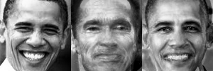

[![License][s1]][li]

[s1]: https://img.shields.io/badge/licence-GPL%203.0-blue.svg
[li]: https://raw.githubusercontent.com/matt77hias/FaceRecognition/master/LICENSE.txt

# FaceRecognition
Course Computer Vision: Face Recognition

**Academic Year**: 2013-2014 (2nd semester - 1st Master of Science in Engineering: Computer Science)

## About
A script detecting faces on pictures and recognizing Arnold Scharzenegger and Barack Obama using a model of Arnold Scharzenegger and Barack Obama, built with a principal component analysis. Input images are transformed from image to **reduced** 'Arnold'/'Barack' space and back to image space.

## Use

PCA Arnold space - PCA Barack space

Arnold images (left): image space -> reduced Arnold (middle) /Barack (right) space -> image space

Barack images (left): image space -> reduced Arnold (middle) /Barack (right) space -> image space

